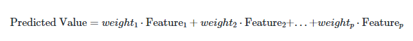
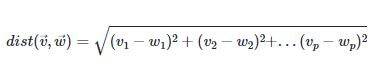
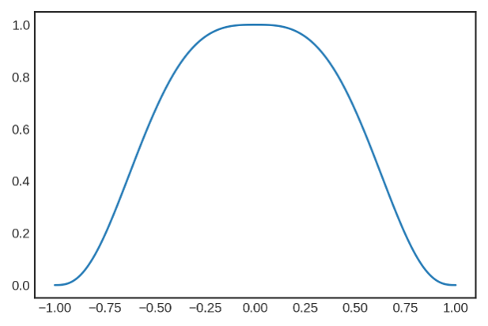
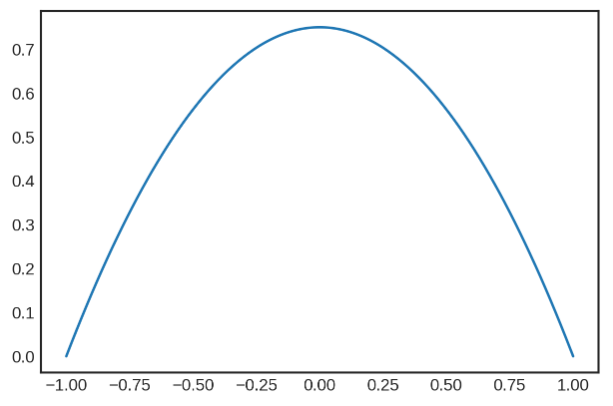
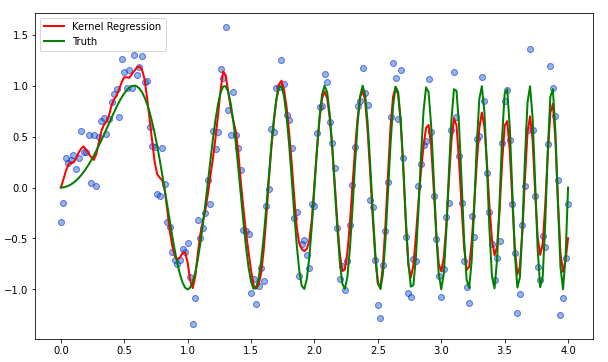

# Project 1: Intro to Locally Weighted Regression

#### Main Ideas

The main idea of linear regression is to make predictions as a weighted combination of the input feauture values where the weights can be positive or negative. As an equation, linear regression looks like:



Locally weighted regression is a method for computing a non-linear trend line for data. This ability is important, as many real-life associations and trends are not linear. Locally weighted regression uses a kernel to calculate a linear regression for the neighborhood each data point, that, when stitched together, show the overall (often non-linear) trend for the data. So, even though trends and associations are generally nonlinear, they can be locally interpreted linearly.

Local properties are relative to a metric, which is a method by which we compute the distance between two observations. Observations contain multiple features, and if they are numeric, we can see them as vectors. The equation for calculating the distance between two p-dimensional vectors is as follows:



In the end, you have the same number of weight vectors as there are different observations in the data.

#### Kernels

When you are preparing to run a locally weighted regression, there are first some hyperparameters you must choose. One of these hyperparameters is the kernel, which determines the shape of the bell-curve that is used to calculate the local weights. This kernel is centered on the current observation, giving more weight to other data points that are closer to the current observation. A visualization is provided below.


Four possible kernel options are the Exponential, the Tricubic, the Epanechnikov, and the Quartic. You can see by looking at the two plots below that each kernel is slightly different. For example, the Tricubic Kernel (left) has thinner tails and a flatter top than the Epanechnikov (right).

 

#### Tau

Tau is a hyperparameter that controls the bandwidth of the kernel. Changing tau will change the weights for calculating the neighborhood around each observation, yielding slightly different locally weighted regressions as it is adjusted. A value for tau must be chosen in addition to the type of kernel being used.

### A Simple Implementation

To complete a locally weighted regression with sample data, you can use the code below.

First, you need to import the appropriate libraries.

```Python
import numpy as np

from sklearn.linear_model import LinearRegression
```


Next, define some functions. This example uses an Epanechnikov kernel.

```Python
def Epanechnikov(x):
  return np.where(np.abs(x)>1,0,3/4*(1-np.abs(x)**2)) 
 
def kernel_function(xi,x0,kern, tau): 
  return kern((xi - x0)/(2*tau))
    
def weights_matrix(x,x_new,kern,tau):
  if np.isscalar(x_new):
    return kernel_function(x,x_new,kern,tau)
  else:
    n = len(x_new)
    return np.array([kernel_function(x,x_new[i],kern,tau)
```

```Python
def lowess(x, y, x_new, kern, tau=0.05):
  w = weights_matrix(x,x_new,kern,tau) 
  if np.isscalar(x_new):
    lm.fit(np.diag(w).dot(x.reshape(-1,1)),np.diag(w).dot(y.reshape(-1,1)))
    yest = lm.predict([[x_new]])[0][0]
  else:
    n = len(x_new)
    yest = np.zeros(n)
    for i in range(n):
      lm.fit(np.diag(w[i,:]).dot(x.reshape(-1,1)),np.diag(w[i,:]).dot(y.reshape(-1,1)))
      yest[i] = lm.predict(x_new[i].reshape(-1,1)) 

  return yest
```

After defining the functions, you can simulate some noisy data.

```Python
lm = LinearRegression()
x = np.linspace(0,4,201)
noise = np.random.normal(loc = 0, scale = .2, size = len(x))
y = np.sin(x**2 * 1.5 * np.pi ) 
ynoisy = y + noise
```

Lastly, run the regression. Here, we use a tau of 0.03.

```Python
yest = lowess(x,ynoisy,x,Epanechnikov,0.03)
```

If you want to visualize the locally weighted regression versus the truth, you can run this code:

```Python
import matplotlib.pyplot as plt
plt.figure(figsize=(10,6))
plt.scatter(x,ynoisy,ec='blue',alpha=0.5)
plt.plot(x,yest,color='red',lw=2,label='Kernel Regression')
plt.plot(x,y,color='green',lw=2,label='Truth')
plt.legend()
plt.show()
```
The plot will look something like this:


